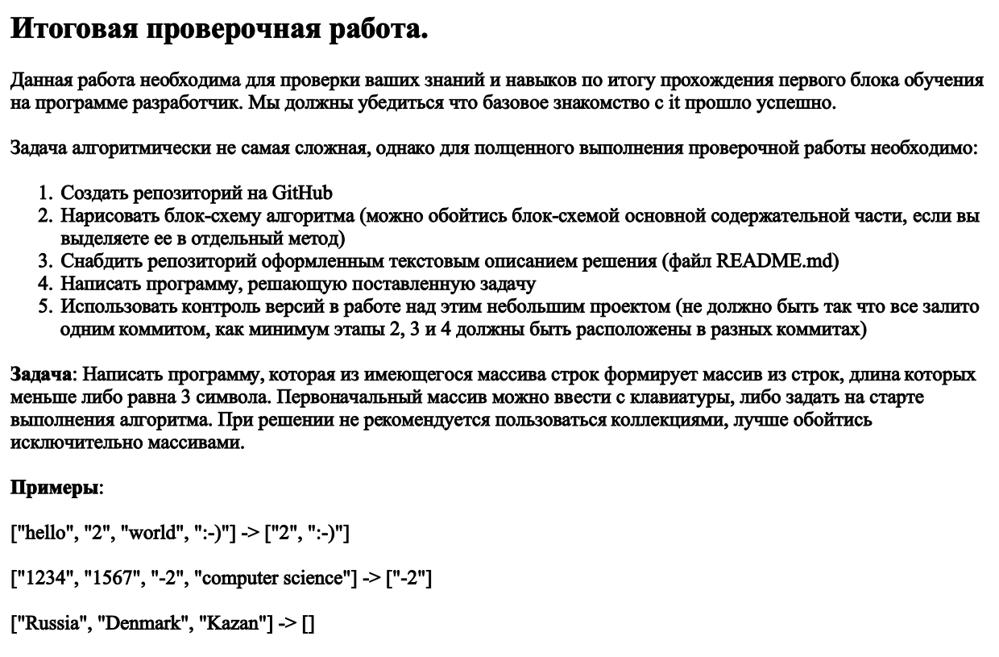
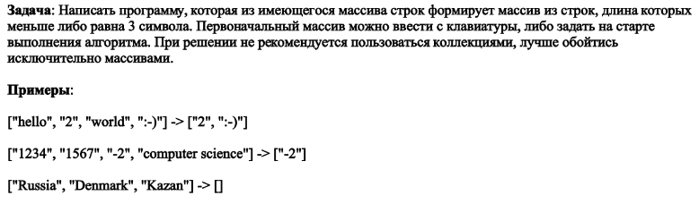

# **<p style="text-align: center;">Итоговое задание по первому блоку обучения. </p>**
Данный файл представляет собой подробное текстовое описание проделанной работы, с описанием каждого отдельного этапа.
<br>Условия выполнения итогового задания по первому блоку представлены на картинке ниже:



## Этап 1. Создание репозитория и подготовка файлов.
1. Создать удаленный репозиторий в GitHub. [Ссылка на репозиторий.](https://github.com/rotoff7/FirstQuarter_final_test)

2. Склонировать удаленный репозиторий на локальную машину командой:
```
git clone <URL>
```
3. Создать в репозитории новый проект командой:
```
dotnet new console
```
4. Создать файл `.gitignore` и внести в него все необходимые файлы. Можно создать заготовку файла с помощью команды: 
```
donet new gitignote
```
## Этап 2. Разработка алгоритма и создание блок-схемы.
Все блок-схемы создавались с использованием [данного ресурса.](https://app.diagrams.net/)

1. Сперва была продумана общая логика работы алгоритма (с учетом работы отдельных методов), файл: `"Блок-схема (Общая логика).png"`.
2. Дальше была прописана логика работы двух, основных, для решения задачи методов. Файлы: `"Блок-схема (Метод подсчета элементов).png"` и `"Блок-схема (Создание нового массива).png"`.
3. Далее составлена детальная схема работы программы в целом. Файл: `"Блок-схема (Общий алгоритм решения).png"`. 
<br> А также фактический, итоговый алгоритм, с учетом необходимости отработки отдельного цикла, для нахождения длины нового массива, а затем его создания и заполнения. Файл: `"Блок-схема (Фактический алгоритм решения).png"`.

## Этап 3. Написание программы на языке C#.
Напомним само условие задачи:



Было решено, что вводить первоначальный массив будет пользователь с клавиатуры, вместо его самостоятельного, "магического" появления на старте выполнения алгоритма. В связи с этим, помимо основных для решения методов *(cоздание и вывод массива, подсчет кол-ва элементов, создание нового массива из нужных элементов)*, появились дополнительные, связанные с проверкой введенных пользователем данных, исключающие ввод некорректных значений.
<br>Также программа снабжена подсказками пользователю, выводящиеся в консоль и комментариями в самом коде программы.

Итоговая программа в файле: `Program.cs`

## Этап 4. Текстовое описание решения и форматирование файлы README.md
На финальном этапе выполнения задания были проведены проверки корректности работы программы, наличия актуальных версий всех необходимых дополнительных файлов в репозитории, написание текстовой документации, в виде подробного описания решения в файле `"README.md"` и его форматирование.